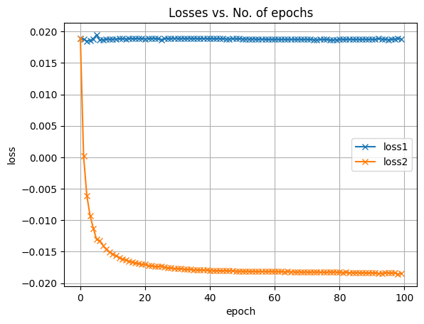
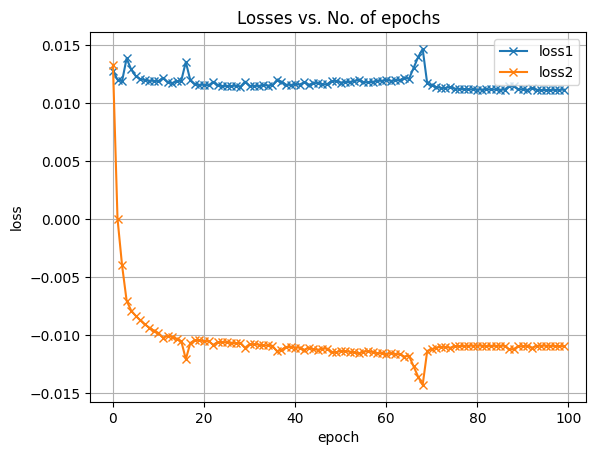
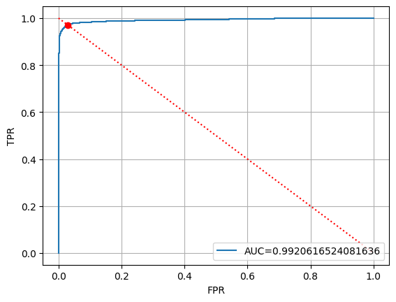

# ZURUSU

## Models

In this project, I built two different Proof-Of-Concept (POC) models capable of classifying microservice server attacks with over 99% accuracy.

### Model version 1: Unlimited Requests

|                                    Learning Curve                                    |     |                      ROC Curve                       |
| :----------------------------------------------------------------------------------: | :-: | :--------------------------------------------------: |
|                                    |     |                        |


### Model version 2: Limited Requests

In this model, I limit the overall CPU usage during attacks to 1.5x the usage during normal periods.

|                                    Learning Curve                                    |     |                      ROC Curve                       |
| :----------------------------------------------------------------------------------: | :-: | :--------------------------------------------------: |
|                                    |     |                        |


## Reproducing

If all you want to do is reproduce the same results I got, you can download and run the [usad notebook](USAD.ipynb)

However, if you want to expand on this project by generating your own dataset(s), follow the below [Build Instructions](#build-instructions).

## Build Instructions

### 1. Clone this repository

```bash
git clone https://github.com/Zachary-Harrison/ZURUSU.git
```

### 2. Set up microservices-demo

Follow the [Quickstart (GKE) instructions](https://github.com/GoogleCloudPlatform/microservices-demo/tree/main#quickstart-gke) provided by microservices-demo. 

Be sure to clone the microservices-demo in a folder that is not already a repository. 

### 3. (Optional) Modify app behavior

The creators of microservices-demo made an amazing [development guide](https://github.com/GoogleCloudPlatform/microservices-demo/blob/main/docs/development-guide.md) for how to run and develop their app locally. This is how you can change the behavior for `loadgenerator` or other microservices.

As a brief summary, you need to create your own Docker images (I recommend using [IntelliJ](https://www.jetbrains.com/idea/download/?section=windows) to help streamline this process). Then you use `skaffold` and `kubectl` to modify the default configuration files to use your image repository instead of the static one provided.

### 4. Simulating attack behavior

In the [JavaScript](JavaScript/) directory, I've provided a few files:
1. [immediateAttacker.js](JavaScript/immediateAttacker.js): Makes requests while running. Mainly used during development to see if you've got things working properly. Use it like this, replacing [http://EXTERNAL_IP] with the frontend's external IP.
   ```bash
    node immediateAttacker.js [http://EXTERNAL_IP]
   ```
2. [timedAttacker.js](JavaScript/timedAttacker.js): Makes requests during specific time intervals. Use it like this, replacing [http://EXTERNAL_IP] with the frontend's external IP.
   ```bash
    node timedAttacker.js [http://EXTERNAL_IP]
   ```
2. [timedAttackerLimited.js](JavaScript/timedAttacker.js): Basically the same as the timedAttacker, but this one limits the number of requests. Use it like this, replacing [http://EXTERNAL_IP] with the frontend's external IP.
   ```bash
    node timedAttacker.js [http://EXTERNAL_IP]
   ```
> **Tip:** Be sure to run this script on a computer that you don't use regularly, because you will need to keep it running during all your attacks.

### 5. Retrieving Data

I have provided two different implementations to retrieve data from this project. The Java version is recommended, as Java more easily supports the reading and creation of large files. 

#### DataExtractor (Java)

1. Open the [DataExtractor (Java)](DataExtractors/Java-DataExtractor/) folder in [IntelliJ](https://www.jetbrains.com/idea/download/?section=windows).
2. Add Run/Debug Configuration. Click [here](https://www.jetbrains.com/help/idea/run-debug-configuration.html) for more information.
   - Main class: Main.java
   - Program arguments: -Xmx2048m 
   - Environment variables: PROJECT_ID=REPLACE_ME
     - Replace REPLACE_ME with your project id, which you can find [here](https://console.developers.google.com/)
3. Update the `startDate` and `endDate` variables in `Main.java`. These dates must be in the UTC timezone. 
4. Update the `attackPeriods` variable in `Main.java`. These dates must be in the UTC timezone.
5. Run your Run/Debug configuration!


#### DataExtractor (Python)

1. Open the [DataExtractor (Python)](DataExtractors/Python-DataExtractor/) in your favorite IDE. 
2. Use [`dotenv`](https://pypi.org/project/python-dotenv/) to set up the PROJECT_ID environment variable. To do so, execute the following command in a terminal, replacing REPLACE_ME with your project id (found [here](https://console.developers.google.com/)):
   ```bash
   echo "PROJECT_ID=REPLACE_ME" > .env
   ```
3. Update the `interval` variable according to the start and end time for the data you'd like to collect. These dates must be in the UTC timezone. 
4. Modify the `attack_periods` variable in `main.py`. These dates must be in the UTC timezone. 
5. Execute your program:
   ```bash
   python main.py
   ```

#### Relevant Resources

- [Retrieving time-series data](https://cloud.google.com/monitoring/custom-metrics/reading-metrics) from a Google Cloud Server.
- Converting between [local time and UTC time](https://www.worldtimebuddy.com/).
- What is [RFFC 3339 format](https://www.rfc-editor.org/rfc/rfc3339#:~:text=Abstract%20This%20document%20defines%20a,times%20using%20the%20Gregorian%20calendar.).

### 6. (Optional) EDA

If you want to see what your data looks like, use the [ATTACK_EDA.ipynb](ATTACK_EDA.ipynb) notebook that I've provided! You can use [Google Collab](https://colab.google/) or use Visual Studio Code (follow the instructions [here](https://code.visualstudio.com/docs/datascience/jupyter-notebooks)).

### 7. Create Your Model

Finally, you can create your model by running the [USAD.ipynb](USAD.ipynb) notebook, substituting your data for the default data. Be sure to modify the notebook so that it's reading your data from the correct spot.


# Future Works

While this is only a POC model, it shows some real potential for using Machine Learning in preventing hackers from attacking various components of microservices! 
- **Idea 1**: Document the project on GitHub so that anyone can reproduce the same results.
- **Idea 2**: Re-produce these results using the other models that Xiao provided.
- **Idea 3**: Make more realistic, covert attacks.
- **Idea 4**: Implement a real-time defense strategy using our model.

# Citations

If you liked this repository, please consider checking these ones out. This project would've been impossible without them:
- [microservices-demo](https://github.com/GoogleCloudPlatform/microservices-demo/tree/main)
- [usad](https://github.com/manigalati/usad)
    ```
    Audibert, J., Michiardi, P., Guyard, F., Marti, S., Zuluaga, M. A. (2020).
    USAD : UnSupervised Anomaly Detection on multivariate time series.
    Proceedings of the 26th ACM SIGKDD International Conference on Knowledge Discovery & Data Mining, August 23-27, 2020
    ```

